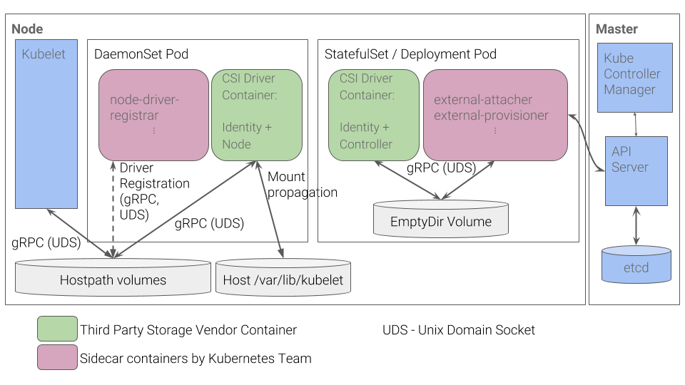
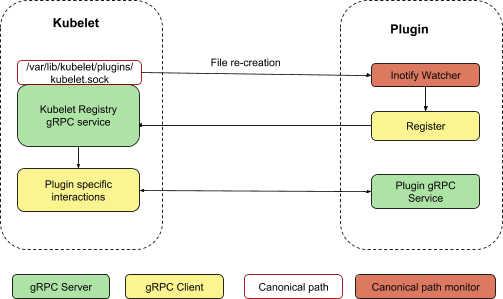

# Container Storage Interface

# Plugin Registration Mechanism

## General Requirements
 - Security/authentication requirements
 - Underlying communication channel to use: stay with gRPC v.s. flexibility to support multiple communication protocol
 - How to detect API version mismatching
 - Ping-pong plugin registration
 - Failure recovery or upgrade story upon kubelet restart and/or plugin restart
 - How to prevent single misbehaving plugin from flooding kubelet
 - How to de-registration
 - Need to support some existing protocol that is not bound to K8s, like CSI

## Plugin registers with Kubelet through grpc (currently used in device plugin)

 - **Currently requires plugin to run with privilege and communicate to kubelet through unix socket under a canonical directory,** but has flexibility to support different communication channels or authentication methods.

 - **API version mismatch is detected during registration**

 - Currently always take newest plugin upon re-registration. Can implement some policy to reject plugin re-registration **if a plugin re-registers too frequently. Can terminate the communication channel if a plugin sends too many updates to Kubelet.**

 - In the current implementation, kubelet removes all of the device plugin unix sockets. Device plugins are expected to watch for such event and re-register with the new kubelet instance. The solution is a bit ad-hoc. There is also a temporary period that we can't schedule new pods requiring device plugin resource on the node after kubelet restart, till the corresponding device plugin re-registers. This temporary period can be avoided if we also checkpoints device plugin socket information on Kubelet side. Pods previously scheduled can continue with device plugin allocation information already recorded in a checkpoint file. Checkpointing plugin socket information is easier to be added in DevicePlugins that already maintains a checkpoint file for other purposes. This however could be a new requirement for other plugin systems like CSI

 

[REF. Plugin Watcher Utility](https://github.com/kubernetes/community/blob/d051d03b66c139d457f68dc10dab3db1367864bb/contributors/design-proposals/node/plugin-watcher.md#model-2-kubelet-watches-new-plugins-under-a-canonical-path-through-inotify-preferred-one-and-current-implementation)

