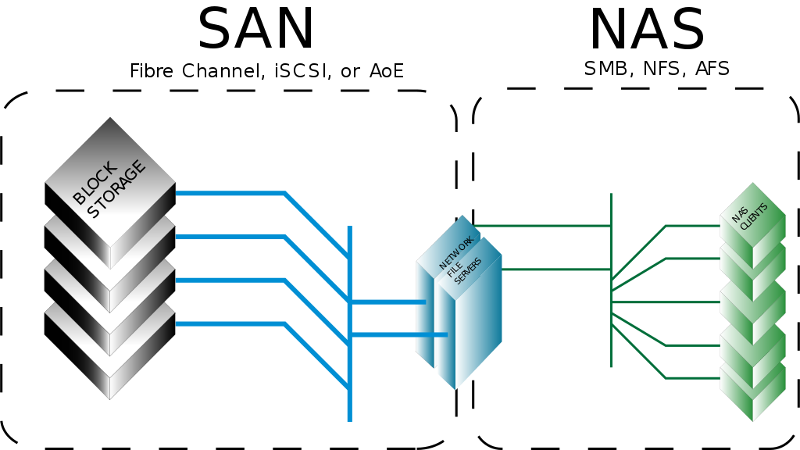

# Storage Type

1. Ephemeral Ephemeral volumes are designed for these use cases. Because volumes follow the Pod's lifetime and get created and deleted along with the Pod, Pods can be stopped and restarted without being limited to where some persistent volume is available. Ephemeral volumes are specified inline in the Pod spec, which simplifies application deployment and management.

2. NAS Storage / FileStorage (SMB, NFS, AFS)
3. SAN Storage / BlockStorage (iSCSI)

# Controller
Controller service interface. This interface is responsible of **controlling and managing the volumes, such as: creating, deleting, attaching/detaching, snapshotting**

If the volumes are part of a Cloud Provider (such as DigitalOcean, GKE, AWS), this interface must be implemented. However if you're planning not to use any kind of block storage or have other ways of providing storage space, you don't have to create this interface

# Node

# REF

[Kubernetes CSI NFS](https://github.com/kubernetes-retired/drivers/tree/master/pkg/nfs)

