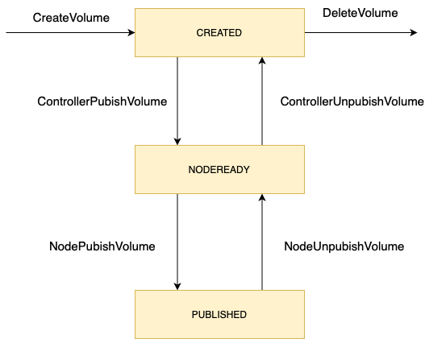
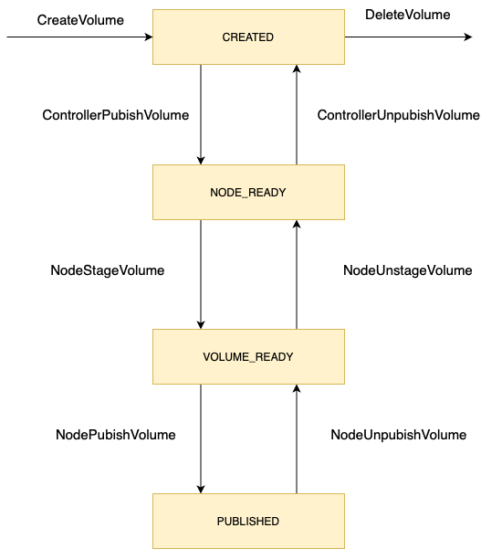
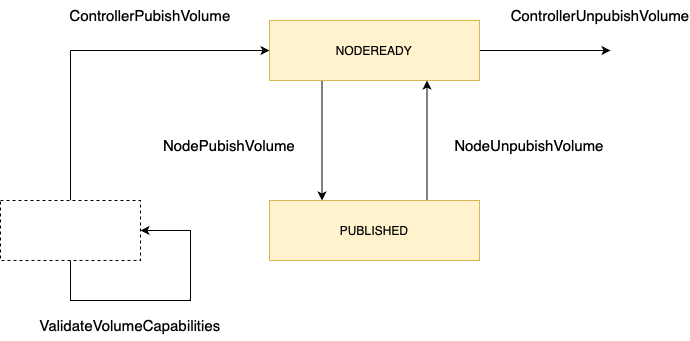
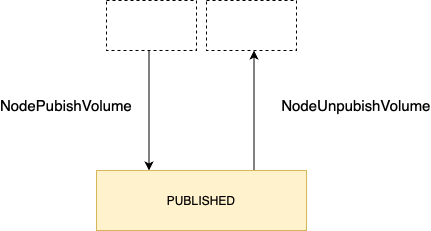

# Storage Type

1. Ephemeral Ephemeral volumes are designed for these use cases. Because volumes follow the Pod's lifetime and get created and deleted along with the Pod, Pods can be stopped and restarted without being limited to where some persistent volume is available. Ephemeral volumes are specified inline in the Pod spec, which simplifies application deployment and management.

2. NAS Storage / FileStorage (SMB, NFS, AFS)
3. SAN Storage / BlockStorage (iSCSI)

# Container Storage Interface

## Controller
Controller service interface. This interface is responsible of **controlling and managing the volumes, such as: creating, deleting, attaching/detaching, snapshotting**

If the volumes are part of a Cloud Provider (such as DigitalOcean, GKE, AWS), this interface must be implemented. However if you're planning not to use any kind of block storage or have other ways of providing storage space, you don't have to create this interface

## Node
**The Node plugin is a gRPC server that needs to run on the Node where the volume will be provisioned.** So suppose you have a Kubernetes cluster with  three nodes where your Pod's are scheduled, you would deploy this to all three nodes.

## Identity

This service needs to be implemented for each individual plugin.For example, if you have two separate plugins running, Node and Controller, both binaries  need to implement the Identity gRPC interface individually.

## Volume Life Cycle

Fig.1 The lifecycle of a dynamically provisioned volume, from
creation to destruction.

Fig.2 The lifecycle of a dynamically provisioned volume, from
creation to destruction, when the Node Plugin advertises the
STAGE_UNSTAGE_VOLUME capability.

Fig.3 The lifecycle of a pre-provisioned volume that requires
controller to publish to a node (`ControllerPublishVolume`) prior to
publishing on the node (`NodePublishVolume`).

Fig.4 Plugins MAY forego other lifecycle steps by contraindicating
them via the capabilities API. Interactions with the volumes of such
plugins is reduced to `NodePublishVolume` and `NodeUnpublishVolume`
calls.
# REF

[Kubernetes CSI NFS](https://github.com/kubernetes-retired/drivers/tree/master/pkg/nfs)

