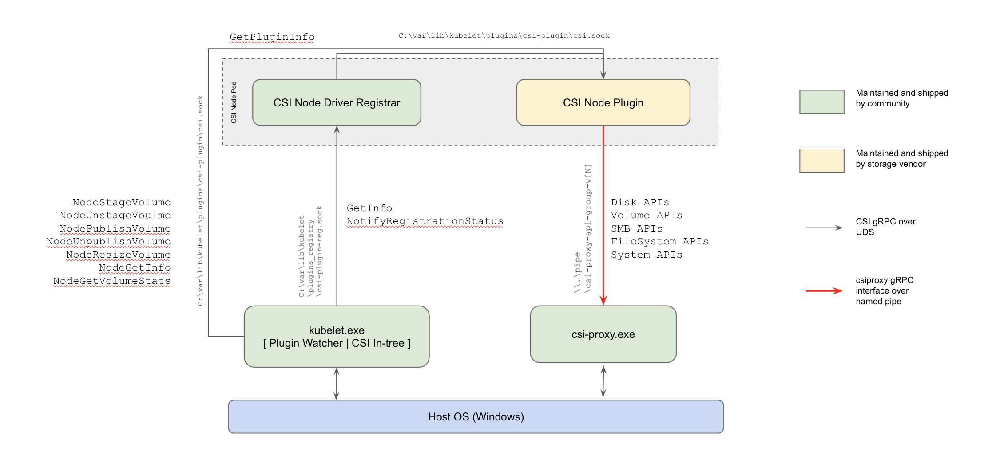

# CSI Kubernetes

- external-attacher 
    - Watches Kubernetes VolumeAttachment objects and triggers ControllerPublish and ControllerUnpublish operations against a CSI endpoint.

- external-provisioner
    - Watches Kubernetes PersistentVolumeClaim objects and triggers CreateVolume and DeleteVolume operations against a CSI endpoint.

- node-driver-registrar
    - Registers the CSI driver with kubelet using the Kubelet device plugin mechanism.

- cluster-deriver-registrar
    - Registers a CSI Driver with the Kubernetes cluster by creating a CSIDriver object which enables the driver to customize how Kubernetes interacts with it.

- external-snapshotter
    - Watches Kubernetes VolumeSnapshot CRD objects and triggers CreateSnapshot and DeleteSnapshot operations against a CSI endpoint.

- livenessprobe
    - May be included in a CSI plugin pod to enable the Kubernetes Liveness Probe mechanism

# REF.
- [Kubernetes CSI NFS](https://github.com/kubernetes-csi/csi-driver-nfs)
- [CSI Design proposals](https://github.com/kubernetes/design-proposals-archive/blob/main/storage/container-storage-interface.md#topology-representation-in-node-objects)
- [Node Driver Registrar](https://github.com/kubernetes-csi/node-driver-registrar/blob/master/README.md)
- [Kubelet Plugin Registration Mechanism](https://kubernetes.io/docs/concepts/extend-kubernetes/compute-storage-net/device-plugins/#device-plugin-registration)
- [Get to Know Container Storage Interface (CSI)](https://www.alibabacloud.com/blog/get-to-know-container-storage-interface-csi_598094)
-