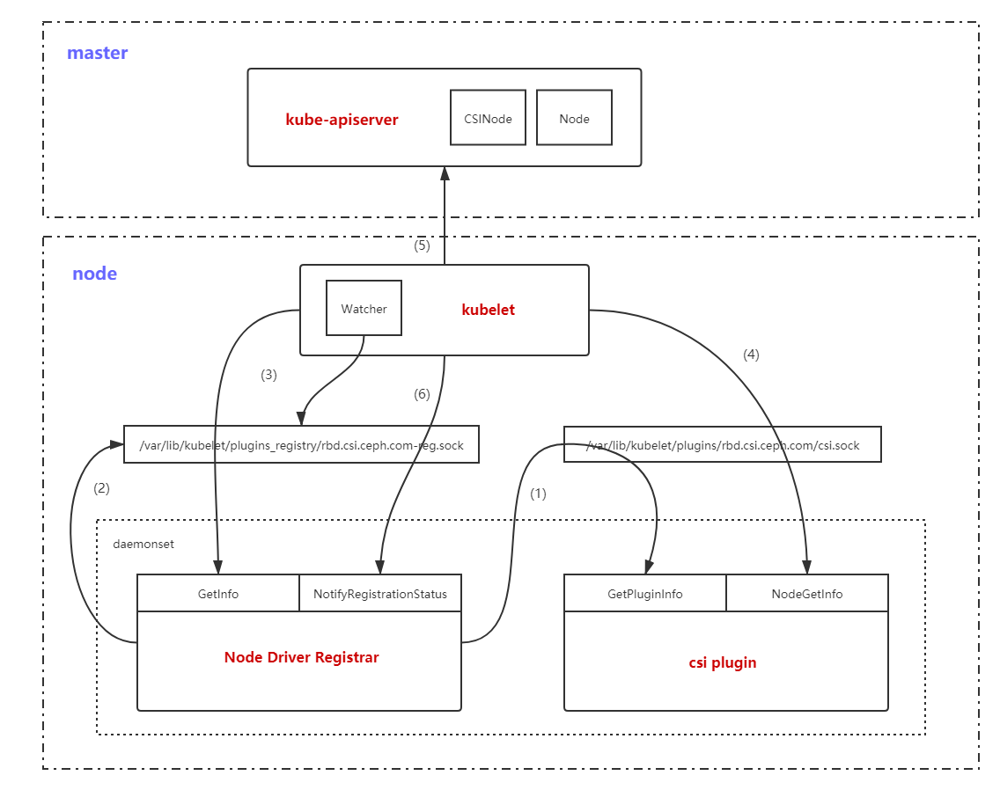

# Kubernetes and CSI

Fig.1
 

|General Management|           |
|------------------|-----------|
|GetPluginInfo|Obtains driver identity information|
|GetPluginCapabilities|Obtains plugin capabilities to determine whether ControllerService or online resizing|
|Probe|Checks the plugin health|

|Node Management|           |
|---------------|-----------|
|NodeStageVolume|initializes or formats a volume on node and mounts the volume to the GlobalPath|
|NodeUnstageVolume| Unmounts the GlobalPath of the volume from the node|
|NodePublishVolume|Mounts the GlobalPath of the volume to the PodPath on the node|
|NodeUnpublishVolume|Unmounts the PodPath of the volume from the node|
|NodeGetVolumeStats|Obtains statistics information on the volume mounting file system on the node, such as total space|
|NodeExpandVolume|Scales out volumes and the file system on a node|
|NodeGetCapabilities|Obtains the list of capabilities provided by node plugin|
|NodegetInfo|Obtains node information, including the node ID, maximum number of mounts, and topology information|

|Central Management|    |
|---|---|
|CreateVolume|Creates a volume, including the remote storage medium and PV object
|DeleteVolume|Delete a volume, including the remote storage medium and PV object|
|ControllerPublishVolume|Mounts a volume by mounting the storage medium to the target node|
|ControllerUnpublishVolume|Unmounts a volume by mounting the storage medium to the target node|
|ValidateVolumeCapabilities|Verifies the controller information, such as AccessMode and VolumeType|
|ListVolumes|Obtians the volume list|
|GetCapacity|Obtains the size capacity of the storage pool that is used to create volumes, which can be specified by parameters or topo|
|ControllerGetCapabilities|Obtains the list of capabilities provided by the controller plug-in|
|CreateSnapshot|Creates a volume snashot and a snapshot object (VolumeSnapshot)|
|DeleteSnapshot|Deletes a volume snashot and a snapshot object (VolumeSnapshot)|
|ListSnapshots|Obtains the list of VolumeSnapshot objects|
|ControllerExpandVolume|Scales out the volume, excluding the file system|

# Node-Driver-Registrar

Node-Driver-Registrar implements CSI plug-in registration

Fig.1 Node-Driver-Registrar

 - **STEP-1** adding a file to the /var/lib/kuberlet/plugins_registry directory is equivalent to **adding a plug-in.**

    **Node-Driver-Registrar** calls the **GetPluginInfo API of the CSI plug-in.** Then, the API returns the listening address of CSI and a driver name of the CSI plug-in.

- **STEP-2** The Node-Driver-Registrar listens to the **GetInfo and NotifyRegistrationStatus APIs.**

- **STEP-3** **A socket in the /var/lib/kuberlet/plugins_registry directory is started to generate a socket file,** such as diskplugin.csi.alibabacloud.com-reg.sock. **The kubelet discovers this socket through the watcher and then calls the GetInfo API of the Node-Driver-Registrar through this socket.** GetInfo returns the obtained CSI plug-in information to the kubelet, including the listening address of the CSI plug-in and the driver name.

- **STEP-4** The kubelet calls the NodeGetInfo API of the CSI plug-in based on the obtained listening address.

- **STEP-5** After calling the API, the kubelet updates some status information, such as the annotations, tags, and status.allocatable of the node, and **creates a CSINode object.**

- **STEP-6** By calling the NotifyRegistrationStatus API of the Node-Driver-Registrar, the kubelet notifies us that the CSI plug-in is registered.

# 
 
- external-attacher 
    - Watches Kubernetes VolumeAttachment objects and triggers ControllerPublish and ControllerUnpublish operations against a CSI endpoint.

- external-provisioner
    - Watches Kubernetes PersistentVolumeClaim objects and triggers CreateVolume and DeleteVolume operations against a CSI endpoint.

- node-driver-registrar
    - Registers the CSI driver with kubelet using the Kubelet device plugin mechanism.

- cluster-deriver-registrar
    - Registers a CSI Driver with the Kubernetes cluster by creating a CSIDriver object which enables the driver to customize how Kubernetes interacts with it.

- external-snapshotter
    - Watches Kubernetes VolumeSnapshot CRD objects and triggers CreateSnapshot and DeleteSnapshot operations against a CSI endpoint.

- livenessprobe
    - May be included in a CSI plugin pod to enable the Kubernetes Liveness Probe mechanism

# CSI Driver NFS (GO Modules)

- identityserver
    - GetPluginInfo
    - Probe
    - GetPluginCapabilities
- controllerserver
    - CreateVolume
    - DeleteVolume
    - ControllerPublishVolume
    - ControllerUnpublishVolume
    - ControllerGetVolume
    - ValidateVolumeCapabilities
    - ListVolumes
    - GetCapacity
    - ControllerGetCapabilities
    - CreateSnapshot
    - DeleteSnapshot
    - ListSnapshots
    - ControllerExpandVolume
    - internalMount
    - internalUnmount
    - newNFSVolume
    - getInternalMountPath
    - getInternalVolumePath
    - getVolumeIDFromNfsVol
    - getNfsVolFromID
    - isValidVolumeCapabilities
- nodeserver
    - NodePublishVolume
    - NodeUnpublishVolume
    - NodeGetInfo
    - NodeGetCapabilities
    - NodeGetVolumeStats
    - NodeUnstageVolume
    - NodeExpandVolume
    - makeDir

# REF.
- [Kubernetes CSI NFS](https://github.com/kubernetes-csi/csi-driver-nfs)
- [CSI Design proposals](https://github.com/kubernetes/design-proposals-archive/blob/main/storage/container-storage-interface.md#topology-representation-in-node-objects)
- [Node Driver Registrar](https://github.com/kubernetes-csi/node-driver-registrar/blob/master/README.md)
- [Kubelet Plugin Registration Mechanism](https://kubernetes.io/docs/concepts/extend-kubernetes/compute-storage-net/device-plugins/#device-plugin-registration)
- [Get to Know Container Storage Interface (CSI)](https://www.alibabacloud.com/blog/get-to-know-container-storage-interface-csi_598094)
- [Storage Architecture](https://www.alibabacloud.com/blog/596307)